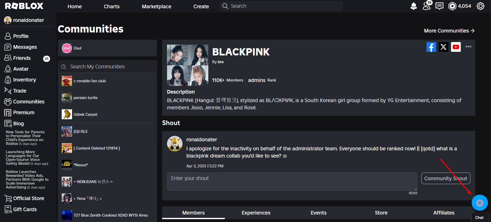
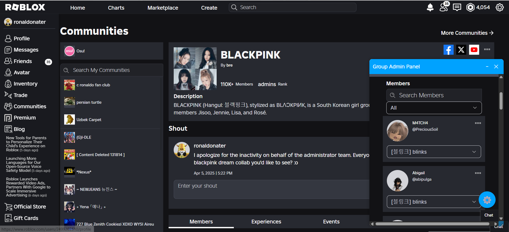
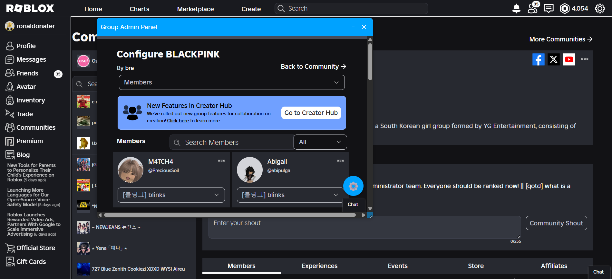
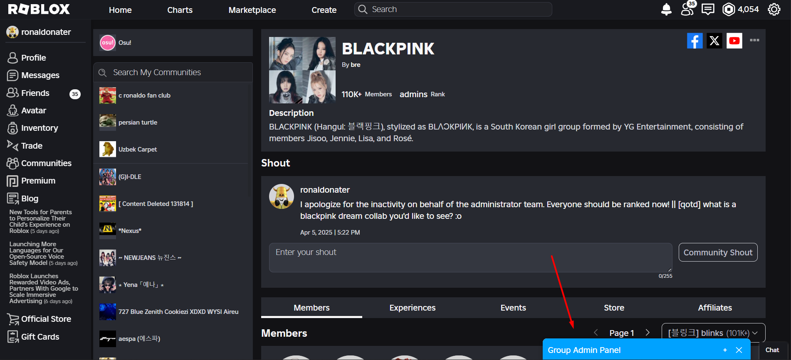

# 🛠️ Roblox Community Floating Admin Panel (Tampermonkey Script)

---

This **Tampermonkey userscript** enhances your experience as a Roblox Community **administrator** by adding a sleek, floating **admin panel** directly onto the Roblox Community page you're visiting — *only if you're an admin of that community*.

> ⚠️ You must be an administrator of the community you're viewing for the panel to be active.

---

## ✨ Features

- 🪟 **Floating Admin Panel**: A clean, minimal interface for quick access to admin tools.
- 🖱️ **Draggable & Resizable Window**: Organize your workspace exactly how you like it.
- 🧹 **Navbar Cleanup**: Automatically removes unnecessary iframed navigation bars for a cleaner, distraction-free view.

---

## 📸 Preview

  
Click to reveal screenshots

   

  
  
  
  

---

## 🚀 Getting Started

1. **Install Tampermonkey**:  
   [Tampermonkey for Chrome](https://chrome.google.com/webstore/detail/dhdgffkkebhmkfjojejmpbldmpobfkfo)  
   [Tampermonkey for Firefox](https://addons.mozilla.org/en-US/firefox/addon/tampermonkey/)

2. **Install the Script**:  
   Click [here](https://raw.githubusercontent.com/ronaldonater/FloatingRobloxCommunityAdminPannel/main/Roblox%20Community%20Floating%20Admin%20Panel.user.js) to install the userscript.

3. Visit any **Roblox Community Page** where you are an administrator — you should now have a settings button in the bottom right corner to access the floating admin panel.

---

## 🧩 Compatibility

- ✔️ Roblox Community Pages (only when you're an admin)
- ✔️ Works with modern browsers
- ✔️ Tampermonkey required

---

## 🛠️ Dev Notes

- Built with flexibility and usability in mind.
- Clean UI interactions powered by native JavaScript and CSS.
- Lightweight, minimal performance impact.

---

## 📬 Feedback / Suggestions

Have ideas for new features or spotted a bug?  
Open an [issue](https://github.com/ronaldonater/FloatingRobloxCommunityAdminPannel/issues) or submit a [pull request](https://github.com/ronaldonater/FloatingRobloxCommunityAdminPannel/pulls) — contributions are welcome!

---

## 📜 License

MIT License

---
